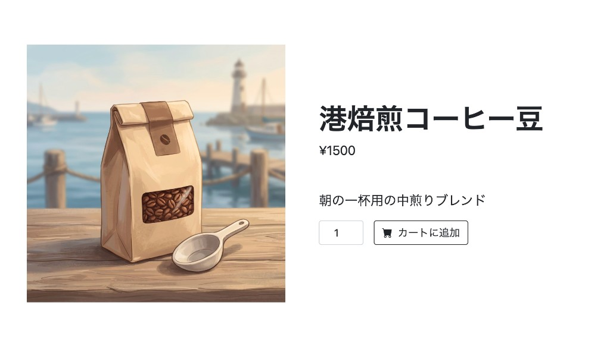
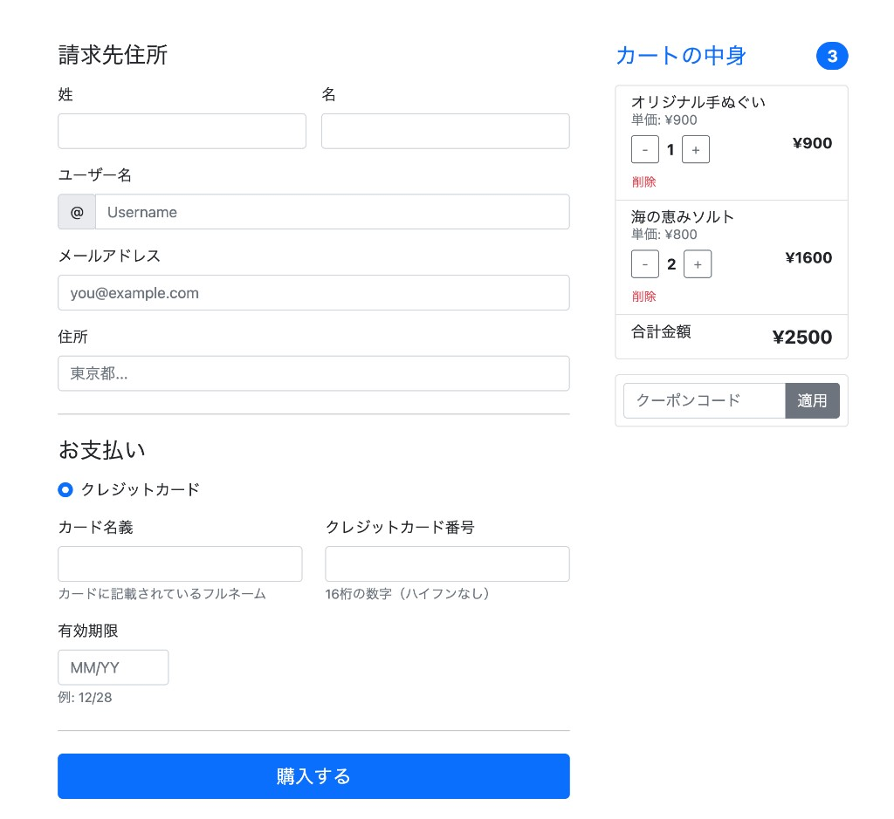
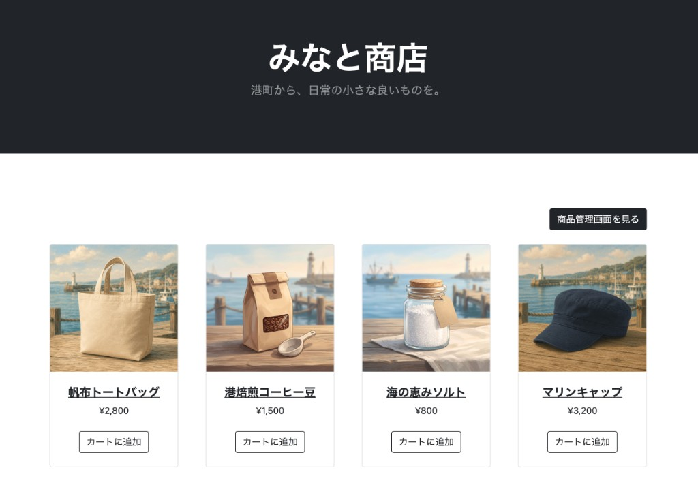
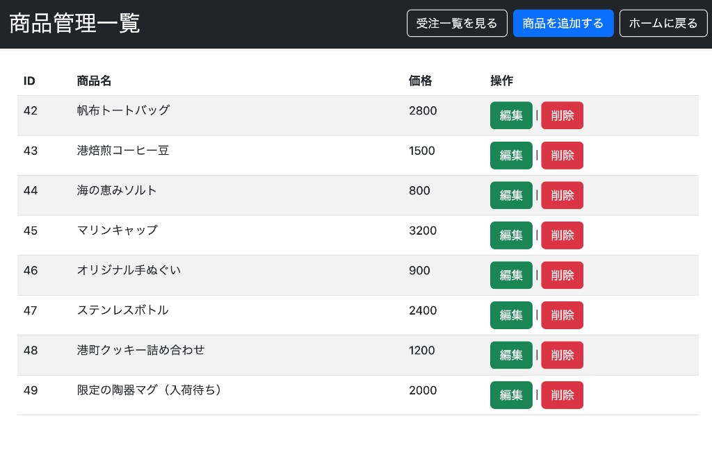

# みなと商店

Django で構築した EC サイトのデモアプリケーションです。商品閲覧からカート、クーポン適用、注文、確認メール送信までの一連のフローを実装しています。

> **Note:** Stripe 等の決済サービスは使用せず、カード情報の入力・保存のみで注文完了となります。本番 EC サイトを想定した決済・セキュリティ設計ではありません。

---

## デモ

| 項目     | 内容 |
| -------- | ---- |
| 商品一覧 | [商品一覧](https://hc-ec-site-ca537aeee08e.herokuapp.com/products/) |
| 管理画面 | [商品管理一覧](https://hc-ec-site-ca537aeee08e.herokuapp.com/products/manage/products/)<br>Basic 認証: `admin` / `pw` ※デモ用 |

### デモ用クーポンコード

カート画面で入力して利用できます。各コードは **1 回限り** です。

| コード    | 割引額 |
| --------- | ------ |
| `qQ0V61a` | ¥600   |
| `MDxAhfK` | ¥700   |
| `seAYF8U` | ¥500   |
| `MGaVu5H` | ¥200   |
| `ddJw2gZ` | ¥900   |
| `MgqAdR5` | ¥700   |
| `fcXwJqC` | ¥800   |
| `lNAWgkR` | ¥200   |
| `cpOa4SC` | ¥700   |
| `DcRekb5` | ¥1000  |

---

## 画面イメージ

| 商品詳細                                               | カート・購入手続き                                         |
| ------------------------------------------------------ | ---------------------------------------------------------- |
|  |      |
| 商品の詳細表示。数量を指定してカートに追加できる。     | カート内容の確認、クーポン適用、請求先・カード情報の入力。 |

| 商品一覧（注文完了後）                                         | 商品管理一覧                                                  |
| -------------------------------------------------------------- | ------------------------------------------------------------- |
|  |  |
| 注文完了後の商品一覧。確認メール送信のメッセージを表示。       | 商品の一覧・編集・削除、受注一覧への導線（Basic 認証）。      |

---

## 主な機能

**ユーザー向け**

- 商品一覧・詳細（関連商品の表示）
- カート（追加・数量変更・削除）
- プロモーションコードの適用
- 注文（請求先・カード情報入力）
- 注文完了メールの送信

**管理者向け**

- 商品の登録・編集・削除（Basic 認証）
- 注文一覧
- Django Admin
- 管理コマンド（初期商品投入、クーポンコード生成）

---

## 技術スタック

| カテゴリ  | 技術                                                         |
| --------- | ------------------------------------------------------------ |
| 言語 / FW | Python 3.12 / Django 4.2                                     |
| DB        | PostgreSQL                                                   |
| フロント  | Bootstrap 5                                                  |
| 画像      | Pillow（開発）/ Cloudinary（本番）                           |
| インフラ  | Docker Compose（開発）/ Heroku, Gunicorn, WhiteNoise（本番） |

---

## 設計のポイント

- **カートの DB 永続化** — セッションに `cart_id` を保持し、カート内容は DB に保存
- **注文処理のトランザクション** — 注文作成・明細保存・クーポン使用済み更新・カートクリアを `transaction.atomic()` で一括処理
- **設定の環境分離** — `base` / `local` / `production` の 3 層構成

---

## ローカル環境構築

### 1. リポジトリをクローン

```bash
git clone https://github.com/Kenichi585-sys/django_ec.git
cd django-template
```

### 2. `.env` を作成

```env
DATABASE_URL="postgres://postgres:postgres@db:5432/django_develop"
SECRET_KEY=<Django SECRET_KEY>
CLOUDINARY_CLOUD_NAME=<Cloudinary cloud name>
CLOUDINARY_API_KEY=<Cloudinary API key>
CLOUDINARY_API_SECRET=<Cloudinary API secret>
EMAIL_HOST_USER=<Gmail アドレス（任意）>
EMAIL_HOST_PASSWORD=<Gmail アプリパスワード（任意）>
```

### 3. Docker を起動

```bash
docker-compose up --build
```

### 4. マイグレーション・初期データ

```bash
docker-compose exec web python manage.py migrate
docker-compose exec web python manage.py seed_products
docker-compose exec web python manage.py promotion_code_generate
```

---

## 実行方法（ローカル）

| ページ   | URL                                                                        |
| -------- | -------------------------------------------------------------------------- |
| 商品一覧 | http://localhost:3000/products/                                            |
| 管理画面 | 商品一覧右上の「商品管理画面を見る」（Basic 認証: `admin` / `pw` ※デモ用） |

> **管理画面への導線について**  
> 商品一覧に管理画面へのボタンを置いています。実際の EC サイトでは、一般ユーザー向けのページから管理画面へリンクすることはありませんが、本プロジェクトではポートフォリオとして管理機能を確認しやすくするため、このボタンを設置しています。
